# Gong Gateway Architecture

This document describes the architecture of Gong Gateway with Mermaid diagrams and implementation-level notes.

Gong Gateway is composed of:

- `gong-core`: the NestJS backend, static unified dashboard, GraphQL API, REST endpoints, SSE metrics stream, and Socket.IO incident room gateway.
- `incident-room`: a React/Vite frontend dedicated to realtime incident collaboration.
- Infrastructure services: Kong, Prometheus, PostgreSQL, and local test providers.

## 1. System Context

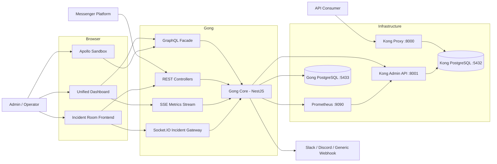

## 2. Runtime Ports

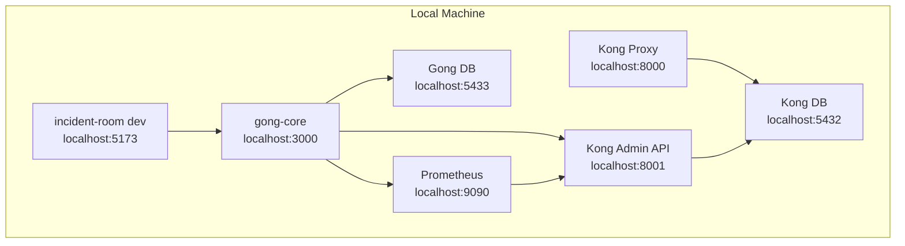

## 3. Application Containers

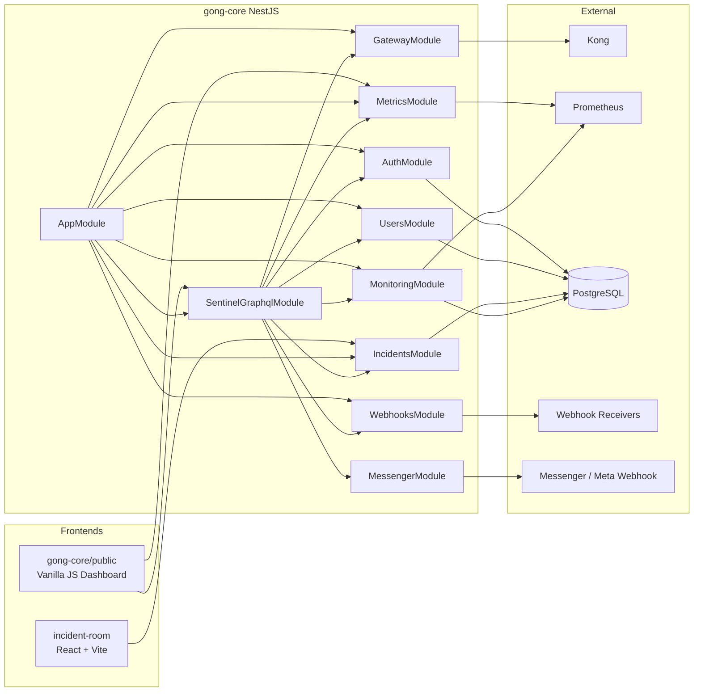

## 4. Backend Module Responsibilities

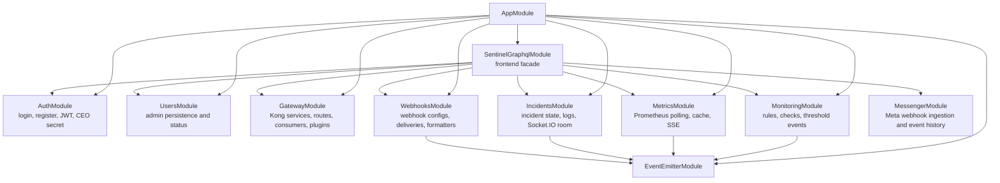

### Module Summary

| Module       | Main owner of                       | Main inputs                                               | Main outputs                                           |
| ------------ | ----------------------------------- | --------------------------------------------------------- | ------------------------------------------------------ |
| `auth`       | Authentication and JWT sessions     | `/auth/login`, `/auth/register`, GraphQL login/register   | JWT access token, authenticated user                   |
| `users`      | Admin user records                  | Auth registration, admin queries                          | User data and account status                           |
| `gateway`    | Kong administration                 | REST/GraphQL gateway actions                              | Kong services, routes, consumers, plugins              |
| `incidents`  | Incident lifecycle and logs         | REST/GraphQL create, Socket.IO actions, monitoring events | Incident snapshots, Socket.IO messages, backend events |
| `monitoring` | Alert rules and checks              | REST/GraphQL rule management, manual checks               | Check reports, threshold events                        |
| `metrics`    | Prometheus metrics cache and stream | Prometheus queries and polling                            | `metrics.updated`, SSE stream, health state            |
| `webhooks`   | Outbound webhook delivery           | Webhook configs, backend events, manual emit              | Delivery attempts and notifications                    |
| `messenger`  | Messenger inbound events            | Meta webhook GET/POST                                     | Stored inbound events and recipient summaries          |
| `graphql`    | Unified frontend facade             | GraphQL queries/mutations                                 | Aggregated typed API responses                         |

## 5. API Surfaces

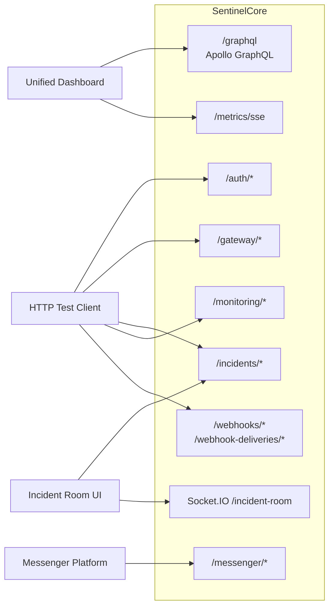

## 6. GraphQL Consumption Flow

The unified dashboard uses GraphQL for most reads and mutations. It stores the JWT in `localStorage` and sends it as a Bearer token.

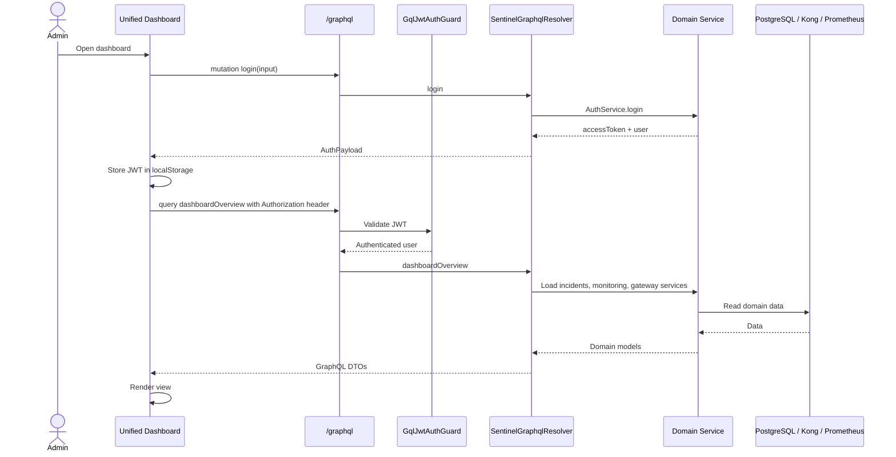

## 7. Metrics Flow

Metrics use two paths:

- GraphQL returns the latest cached metrics when the dashboard loads the metrics page.
- SSE pushes live metric events to update cards and charts in realtime.

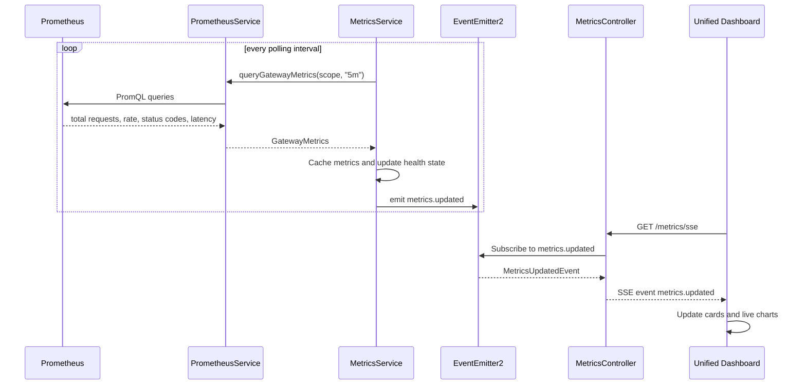

## 8. Incident Room Flow

The Incident Room has two realtime scopes:

- Global incident feed: all connected clients can receive newly created incidents.
- Per-incident room: admins who joined a specific incident receive messages, presence, ack, and resolve updates.

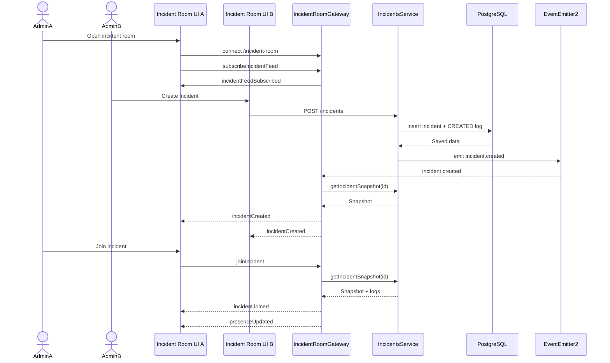

## 9. Incident State Machine

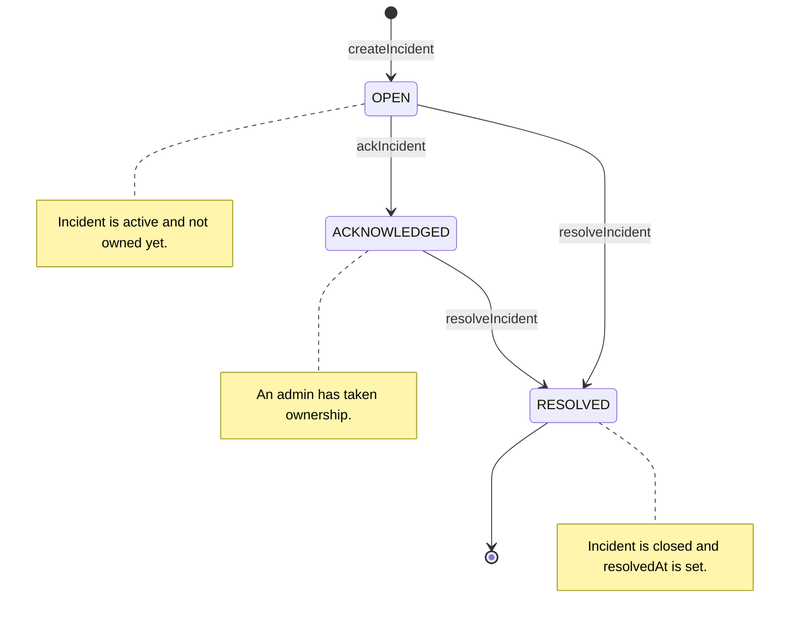

## 10. Monitoring To Incident Flow

Monitoring rules can generate incidents through backend events. The monitoring module does not directly talk to webhooks or frontend clients.

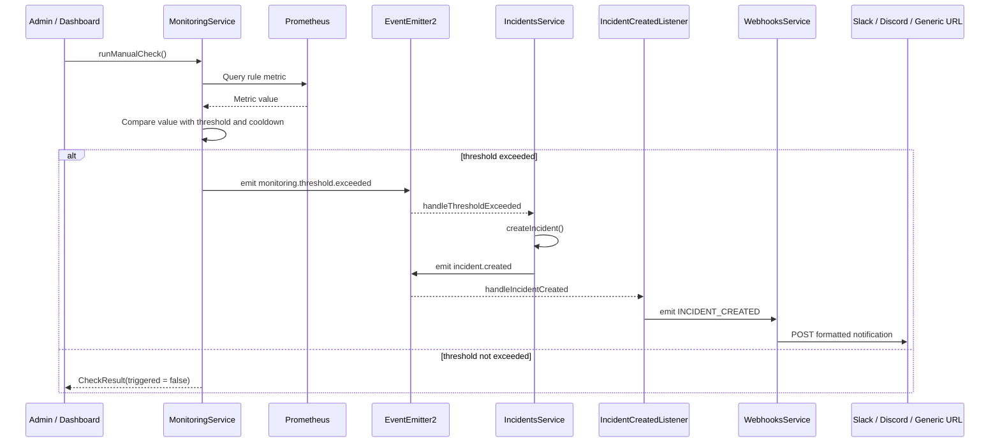

## 11. Webhook Delivery Flow

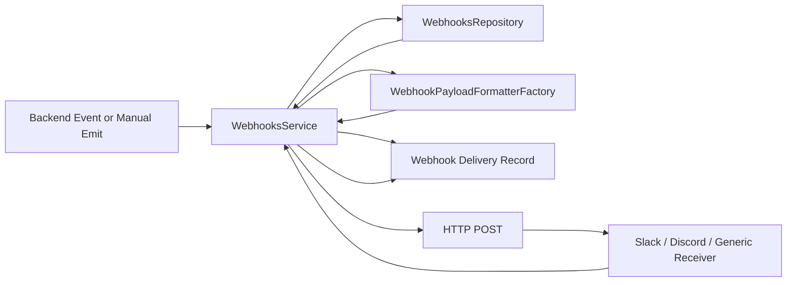

## 12. Messenger Inbound Flow

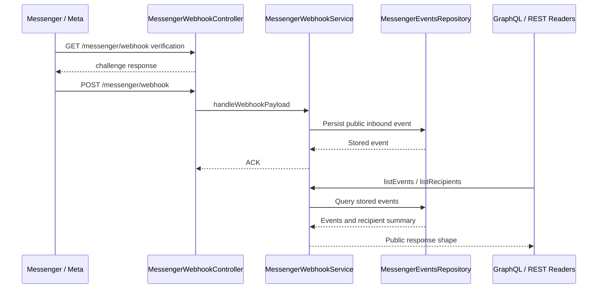

## 13. Data Model

Gong stores its own operational data in PostgreSQL. Kong configuration is mainly managed through Kong Admin API and stored by Kong in its own database.

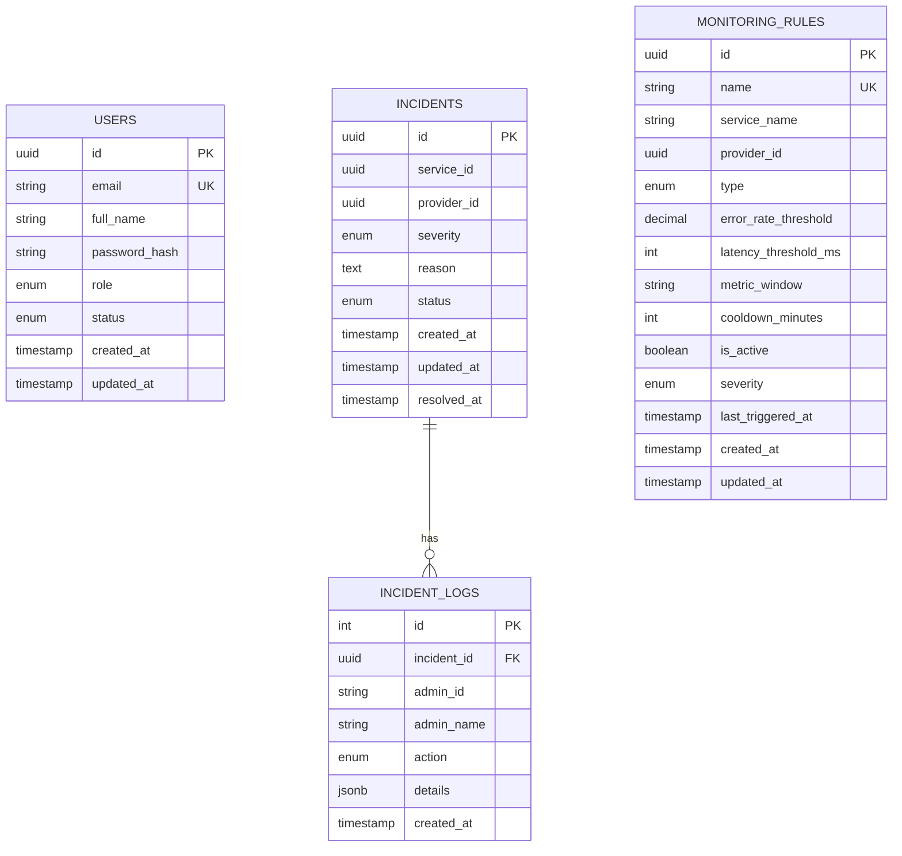

## 14. Backend Events vs Frontend Messages

The project keeps a clear boundary between internal backend events and frontend transport messages.

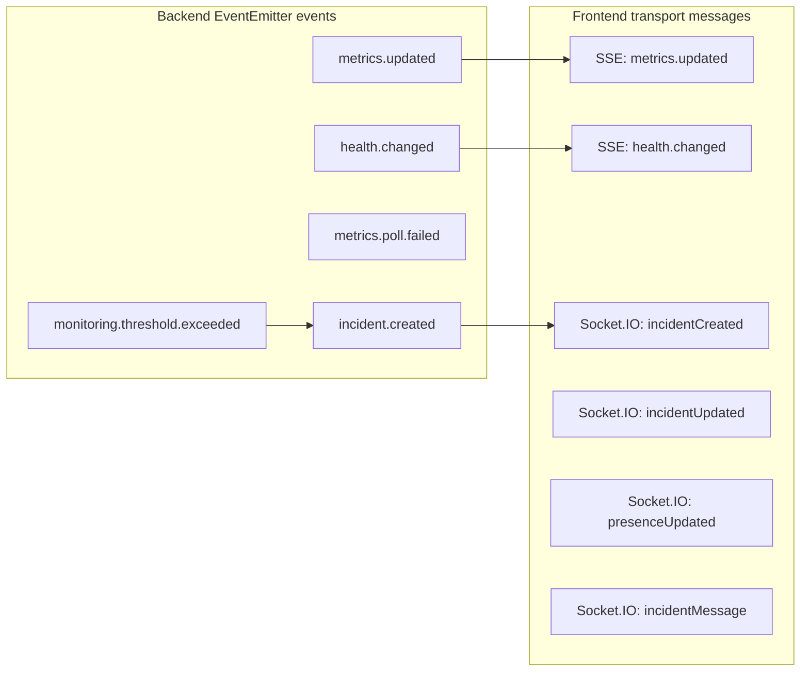

### Important Rule

Domain services should not own frontend sockets or browser-specific behavior.

- `IncidentsService` owns incident business logic and database writes.
- `MetricsService` owns metrics polling, cache, and backend metric events.
- `IncidentRoomGateway` owns Socket.IO connections, rooms, and emitted socket messages.
- `MetricsController` owns the SSE stream boundary.
- `SentinelGraphqlResolver` owns the GraphQL facade and maps domain objects to GraphQL types.

## 15. Request Ownership

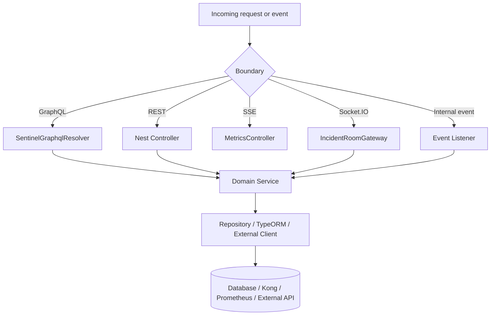

## 16. External Dependencies

| Dependency                     | Used by                                  | Purpose                                                          |
| ------------------------------ | ---------------------------------------- | ---------------------------------------------------------------- |
| Kong Admin API                 | `GatewayService`                         | Manage services, routes, consumers, plugins, and credentials.    |
| Kong Proxy                     | Runtime traffic                          | Receives real API traffic from consumers.                        |
| Prometheus                     | `PrometheusService`, `MonitoringService` | Query gateway metrics and rule values.                           |
| PostgreSQL                     | TypeORM modules                          | Store users, incidents, logs, monitoring rules, and local state. |
| Slack / Discord / Generic URLs | `WebhooksService`                        | Send incident and admin notifications.                           |
| Messenger / Meta               | `MessengerWebhookController`             | Receive inbound social messages and postbacks.                   |

## 17. Frontend Consumption Pattern

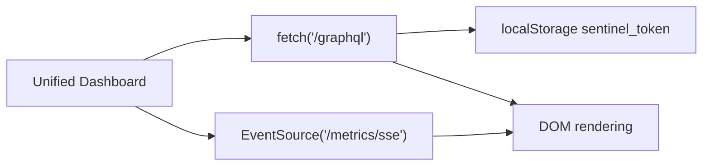

The unified dashboard is intentionally simple:

- no frontend build step for `gong-core/public`;
- GraphQL strings are declared in `public/app.js`;
- `fetch('/graphql')` handles queries and mutations;
- `EventSource('/metrics/sse')` handles live metrics;
- in-memory state drives rendering.

The dedicated incident room is separate because it has a more interactive collaboration model:

- React state;
- Socket.IO connection to `/incident-room`;
- REST for initial incident list/detail loading;
- Socket.IO for feed updates, presence, chat, acknowledge, and resolve.

## 18. Extension Points

Good places to extend the system:

| Need                              | Recommended place                                                        |
| --------------------------------- | ------------------------------------------------------------------------ |
| Add a new dashboard read model    | Add a GraphQL query in `SentinelGraphqlResolver`.                        |
| Add a new domain action           | Add service method first, then expose via REST/GraphQL/socket if needed. |
| Add a new webhook provider        | Add formatter under `webhooks/formatters`.                               |
| Add a new monitoring rule type    | Extend `MonitoringRuleType` and `MonitoringService`.                     |
| Add a new realtime browser stream | Emit backend event first, then bridge it in a controller/gateway.        |
| Add a new Messenger event shape   | Extend messenger models and repository mapping.                          |

## 19. Testing Strategy

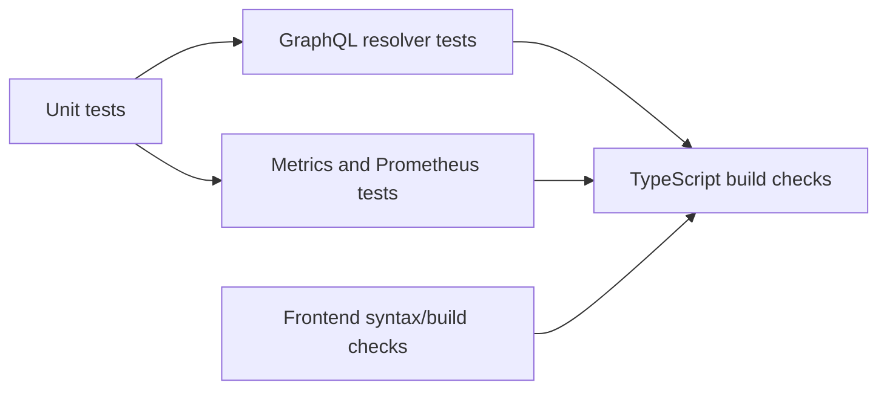

Useful validation commands:

```powershell
cd gong-core
npm test
npx tsc --noEmit -p tsconfig.build.json
node --check public\app.js
```

```powershell
cd incident-room
npm run build
```

## 20. Architectural Principles

- Keep business logic inside services.
- Keep transport-specific behavior inside controllers, resolvers, gateways, or SSE controllers.
- Use backend events to decouple modules.
- Use GraphQL as a frontend facade, not as the domain model itself.
- Use SSE for one-way live metrics.
- Use Socket.IO for bidirectional collaboration.
- Keep Kong configuration ownership in the gateway module.
- Keep incident state independent from the incident room frontend.
- Keep metrics resilient to missing or non-finite Prometheus values.
